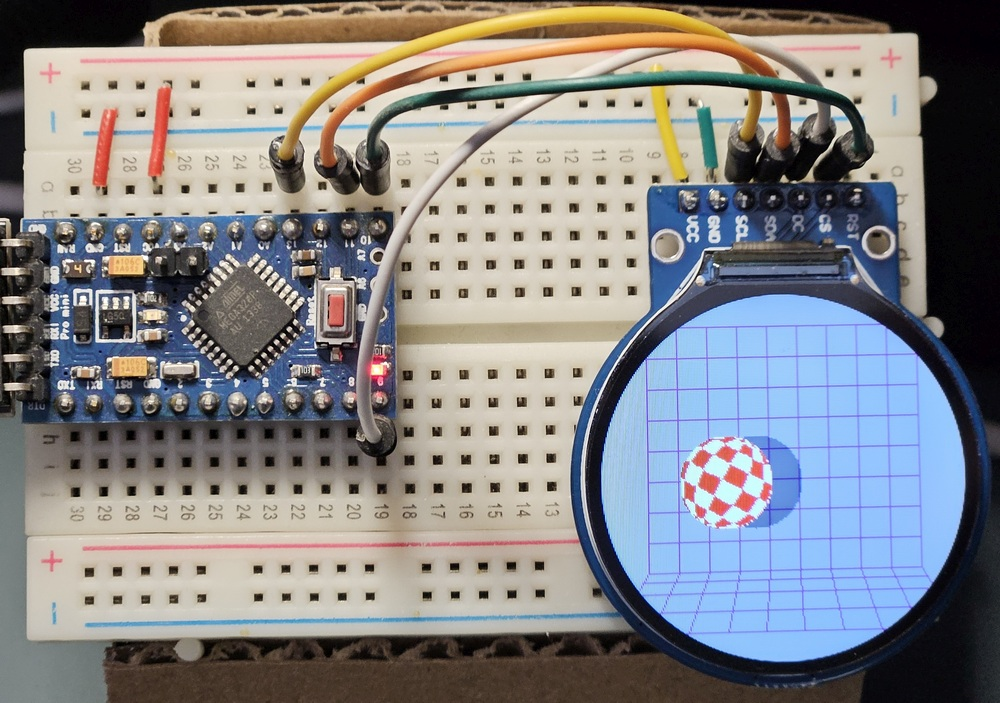
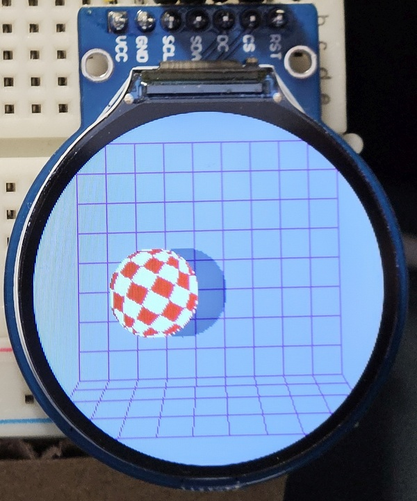
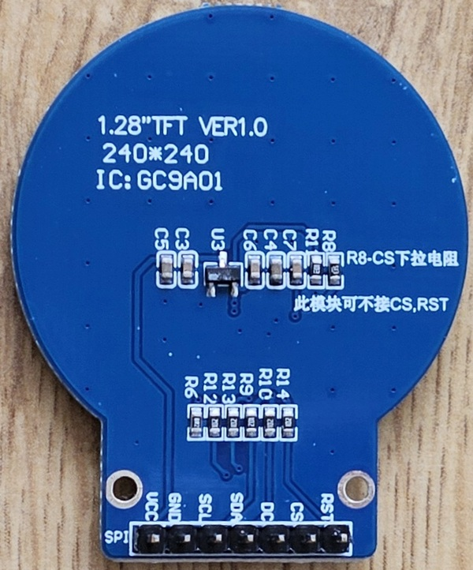
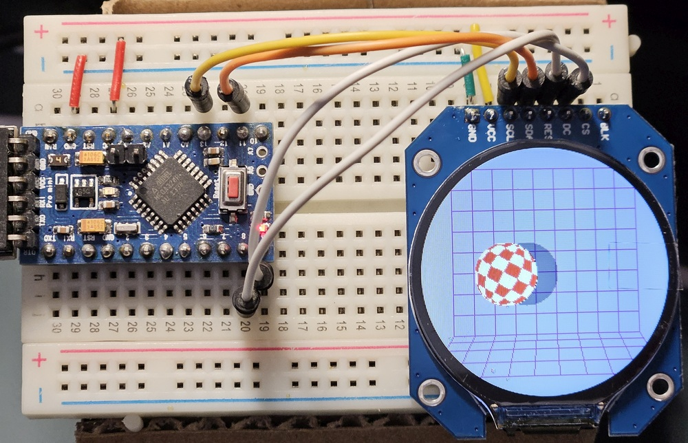
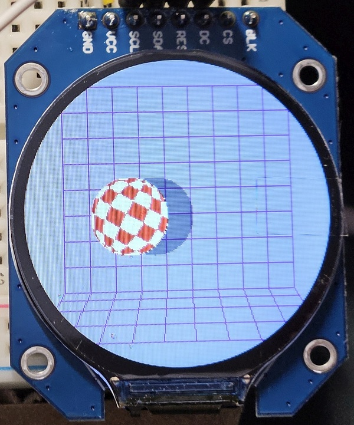
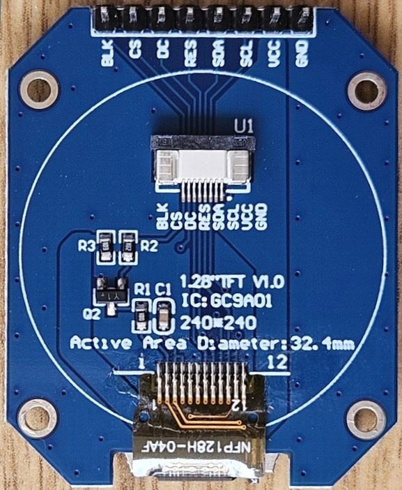

[![license-badge][]][license] ![version]  ![hit-count] [![github-issues][]][issues]

# GC9A01A_AVR
Fast SPI library for the GC9A01A IPS display optimized for AVR Arduinos

Significantly optimized for 16MHz **AVR Arduino boards** (2.5-5x faster than other libraries).

Achieved 7.1Mbps SPI transfer rate (at DIV2/16MHz clock).

In compatiliblity mode it **should** work with other MCUs, but I didn't test all configurations.

YouTube video:

https://youtu.be/9RZII8Vx2ZY

YouTube playlist with all videos related to fast Arduino IPS library:

https://www.youtube.com/playlist?list=PLxb1losWErZ7thUyB05phRR3DoiYN_kcD

## Configuration

Use **#define COMPATIBILITY_MODE** - then the library should work on all Arduino compatible boards

Remove above for the best performance on 16MHz AVR

Use **#define CS_ALWAYS_LOW** for LCD boards where CS pin is internally connected to the ground, it gives better performance

Optimized fast line clipping (**#define FASTLINE_CLIP mode**): #0=off, #1=cut corners, #2=clip using circle

Use "#define FASTLINE_CLIP 2" for maximum performance

I you need fullscreen scrolling use rather regular clipping "#define FASTLINE_CLIP 0"

Tested with **Arduino IDE 1.6.5 and Adafruit_GFX 1.5.6**

## Extra Features
- invertDisplay()
- sleepDisplay()
- enableDisplay()
- idleDisplay() - saves power by limiting colors to 3 bit mode (8 colors)
- resetDisplay() - software reset
- partialDisplay() and setPartArea() - limiting display area for power saving
- setScrollArea() and setScroll() - smooth vertical scrolling
- fast drawImage() from RAM
- fast drawImage() from flash (PROGMEM)
- optimized fast line clipping #0=off, #1=cut corners, #2=clip using circle, use "#define FASTLINE_CLIP mode"

## Tested displays:

- round 240x240 1.28" IPS on round PCB

|Circuit|Front|Back|
|--|--|--|
| | ||

- round 240x240 1.28" IPS on square PCB

|Circuit|Front|Back|
|--|--|--|
| | ||

## Connections - only 4 signal wires + VCC + GND are necessary:

Variant with round PCB and RST+DC only, default setRotation(2)

 |LCD pin|LCD pin name|Arduino|
 |--|--|--|
 |#01| VCC |VCC (3.3V only?)|
 |#02| GND| GND|
 |#03| SCL |D13/SCK|
 |#04| SDA|D11/MOSI|
 |#05| DC|D9 or any digital|
 |#06| CS|optional, when not used then CS_ALWAYS_LOW should be defined|
 |#07| RST |D10 or any digital|

 Variant with round PCB and CS+DC only

 |LCD pin|LCD pin name|Arduino|
 |--|--|--|
 |#01| VCC |VCC (3.3V only?)|
 |#02| GND| GND|
 |#03| SCL |D13/SCK|
 |#04| SDA|D11/MOSI|
 |#05| DC|D9 or any digital|
 |#06| CS|D10 or any digital|
 |#07| RST | NC|

Variant with square PCB and RST+DC only, use setRotation(0)

|LCD pin|LCD pin name|Arduino|
 |--|--|--|
 |#01| GND| GND|
 |#02| VCC |VCC (3.3V only?)|
 |#03| SCL |D13/SCK|
 |#04| SDA|D11/MOSI|
 |#05| RST |D10 or any digital |
 |#06| DC|D9 or any digital|
 |#07| CS|optional, when not used then CS_ALWAYS_LOW should be defined|
 |#08| BLK | NC or VCC|

If you find it useful and want to buy me a coffee or a beer:

https://buycoffee.to/cbm80

https://www.paypal.me/cbm80amiga

[license-badge]: https://img.shields.io/badge/License-GPLv3-blue.svg
[license]:       https://choosealicense.com/licenses/gpl-3.0/
[version]:       https://img.shields.io/badge/Version-1.2.1-green.svg
[hit-count]:     https://hits.seeyoufarm.com/api/count/incr/badge.svg?url=https%3A%2F%2Fgithub.com%2Fcbm80amiga%2FGC9A01A_AVR&count_bg=%2379C83D&title_bg=%23555555&icon=&icon_color=%23E7E7E7&title=hits&edge_flat=false
[github-issues]: https://img.shields.io/github/issues/cbm80amiga/GC9A01A_AVR.svg
[issues]:        https://github.com/cbm80amiga/GC9A01A_AVR/issues/
